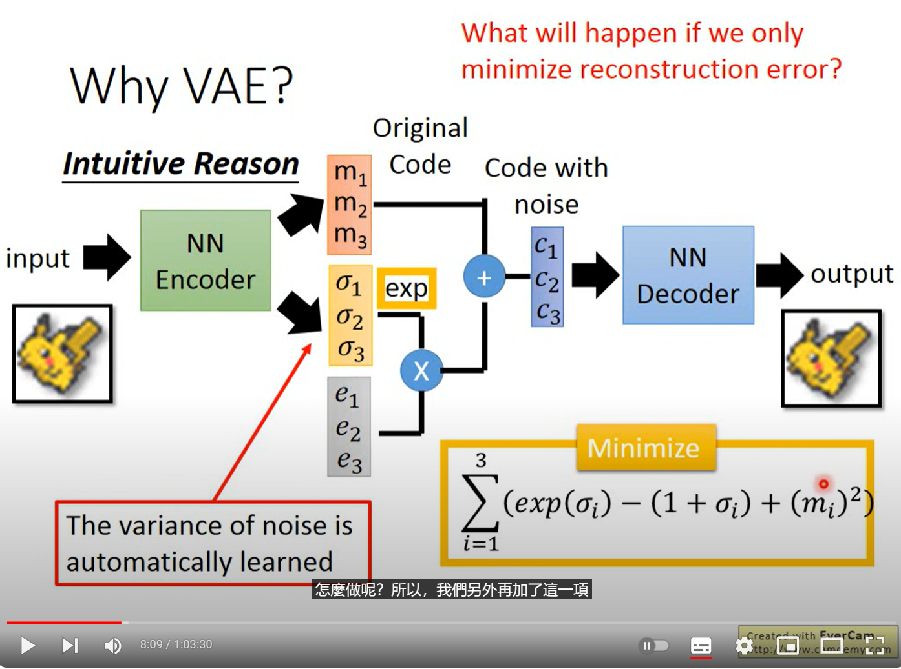

# 李宏毅（Hung-yi Lee）机器学习 ML Lecture 17: Pokemon Creation (VAE 生成宝可梦 相关实验)


本仓库使用Pytorch实现了课程中的宝可梦生成练习，即通过简单的VAE学习一个的宝可梦数据集的分布空间，并通过VAE的各种性质实现渐变的宝可梦可视化。
## 课程所提供的各种信息：
- 课程链接：[[Youtube] ML Lecture 17: Unsupervised Learning - Deep Generative Model (Part I)](https://www.youtube.com/watch?v=YNUek8ioAJk&list=PLJV_el3uVTsPy9oCRY30oBPNLCo89yu49&index=27)
- 数据集下载链接：
  - **注意：因为修改后的数据集很小，所以本仓库已经包含了所需要的所有数据集！这里只是下载链接的备忘录！！！**
  - [40x40的宝可梦图像数据集](https://speech.ee.ntu.edu.tw/~tlkagk/courses/ML_2016/Pokemon_creation/image.rar)
- VAE范式参考：
  - 
## 本仓库简介
### 任务简介
- 通过在700余张宝可梦图像中学习宝可梦图片的分布，实现变分自编码器（VAE），并可视化学习后得到的效果。
### 模型简介
- 仅仅使用了比较简单的多层感知机实现模型作为VAE的编码器和解码器。
- 学习率使用了Warm up和COS规划两个技术。
### 文件简介：
- [main.py](main.py)：训练的主入口，可以通过调参训练不同参数的VAE，并使用Tensorboard监视。
- `utils`文件夹：包含了各种训练所需的包，读取数据集的class，以及学习率规划等等功能都在里面，
- [test_vae.py](test_vae.py)用于测试训练好的权重文件（checkpoint）并绘制网格图的脚本。
### 使用方法：

- 首先需要解压数据集，将仓库中的`image.rar`解压为当前仓库工作路径下的`./figure`及其包含的图像文件。


- 训练启动：
按照如下指令可以训练过程，并通过Tensorboard实时查看生成效果。
  ```bash
  python main.py
  ```
  特别的，可以通过命令行参数设置如下种种训练参数，尤其是`latent_size`默会影响后续可视化的效果。默认值请参考[main.py](main.py)中的`get_args_parser`函数：
  ```
  options:
    -h, --help            show this help message and exit
    --hidden_size HIDDEN_SIZE
                          VAE settings, size of hidden layer for encoder and decoder
    --latent_size LATENT_SIZE
                          VAE settings, size of the latent vector.
    --batch_size BATCH_SIZE
                          Batchsize per GPU
    --output_dir OUTPUT_DIR
                          output dir for ckpt and logs
    --epoch EPOCH         Number of epochs
    --lr LR               Learning rate
    --device DEVICE       Device: cuda or GPU
    --test_period TEST_PERIOD
                          Test when go through this epochs
    --save_period SAVE_PERIOD
                          masked rate of the input images
    --warmup_epochs WARMUP_EPOCHS
                          warmup epochs
    --min_lr MIN_LR       min lr for lr schedule
    --seed SEED           random seed init
  ```

  - Tensorboard监视训练过程：
    - 在安装了Tensorboard之后，在当前工作路径中使用如下命令，并通过浏览器打开对应本地域名即可实现监视训练过程：
      ```bash
      tensorboard --logdir ./
      ```

- 测试方法
  - 训练好的checkpoint应该会保存在一个以`output`开头的文件夹下，请修改[test_vae.py](./test_vae.py)脚本开头的`ckpt_path`变量以匹配你生成的checkpoint。
  - 还有一些其他参数可以调整visualize的设置，请参照说明尽情调整吧！
  - 会生成两张图，一张是`visualize_of_intput_image.png`，它是你输入VAE重建的图像（即后一张图正中心的图像）。另一张则是生成的通过网格参数搜索得到的VAE渐变图。

### 一些调参tips
- lr基本就是5e-4是比较理想的
- 为了确保网格化参数搜索可以比较有效的促进图像变换，latent_size不能太大，否则各个隐空间的上的点会过于独立，16左右就比较合适了。
- 目前默认为10000epoch，目测可以较好的收敛。
- batch_size可以根据不同的设备适当调整，可能也需要跟着调整epoch和lr
- **可以多做尝试，多换学习率和随机种子，有好的结果或者不好的结果可以在本仓库的[discussion版块](https://github.com/SunnyHaze/VAE-Pokemon-Creation/discussions)一起讨论。**


### 一些生成结果展示
参数为：`lr5e-4_epoch10000_color_latent16-checkpoint_9600.pt_step11_bound3_dim[2,6].png`


********
参数为：`lr5e-4_epoch10000_color_latent16-checkpoint_9600.pt_step21_bound3_dim[2,6].png`


## 结语
如果喜欢的话，给个Star呗！也欢迎提issue优化可能的bug！

----------

<div align="center"><a href="https://info.flagcounter.com/Ks77"></a></div>
